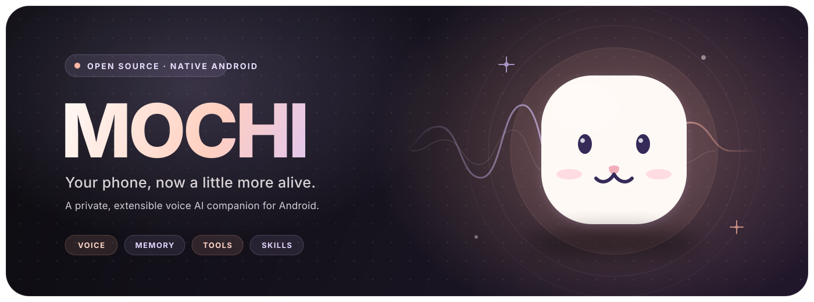

# Mochi

### Your phone, now a little more alive.

**A powerful, free and open-source voice AI assistant—and a great way to give
an old Android phone a new purpose.**

[English](README.md) · [简体中文](README.zh-CN.md) · [Documentation](docs/README.md)

---

Mochi is a powerful, free and open-source personal voice AI assistant built
natively for Android. Say **“Hi Mochi”** to wake it whenever you need it, then
continue a natural hands-free conversation. Mochi combines voice, memory,
planning, Tools, and Agent Skills—and brings the right screen or result into
view as the conversation unfolds. Install it on a spare or retired Android
phone to turn that device into a dedicated always-ready AI companion, desk
display, planner, and smart-home voice terminal instead of leaving useful
hardware in a drawer.

### Always ready for your voice

- Wake Mochi anytime with the on-device **“Hi Mochi”** wake word.
- Continue speaking naturally through automatic follow-up listening.
- Use Android speech recognition by default, or optionally connect built-in
  iFlytek/Azure Speech-to-Text settings for greater reliability.
- Hear responses through Android text-to-speech.
- Let the conversation open the relevant date, weather, planner, or result
  screen automatically.

### More than a chat screen

| Voice first | Remember what matters | Get real work done |
| --- | --- | --- |
| Always-ready “Hi Mochi” wake word and continuous voice conversation | Local conversation history and relevant long-term memory | Built-in Tools for web, maps, weather, calendar, todos, and documents |
| Android speech recognition by default, with optional built-in iFlytek/Azure STT settings; Android TTS and text input remain available | Editable `SOUL`, `USER`, and `AGENTS` persona files | Trusted cards and automatic navigation surface results at the right moment |

| Your AI knowledge base and workspace | Expand through the Skill Market |
| --- | --- |
| Built-in Notion and Tencent Docs Skills connect in one tap, then help search, read, create, and update documents | Discover and install community Agent Skills from the built-in skills.sh market |

### Built-in Skills

| Skill | Default | What it does | Required setup |
| --- | --- | --- | --- |
| Mochi Planner | Enabled | Manages Mochi calendar events and dated todos | None |
| Voice Navigation | Enabled | Opens the relevant native Mochi surface from conversation intent | None |
| Scheduled Automations | Enabled | Runs one-time or recurring Agent prompts and writes results to Conversation | Notification permission; exact-alarm access is optional |
| Web Search | Enabled | Researches public web and WeChat official-account content through Agent Browser | None |
| Product Search | Enabled | Finds and compares public product pages without ordering or payment | None |
| Douban Ratings | Enabled | Reads public Douban ratings, counts, and review themes | None |
| US Stock Analysis | Enabled | Compares the Magnificent Seven using quotes, capital flow, support/resistance, ratings, targets, financials, and news | None; uses public Baidu Stock and issuer pages |
| Notion Knowledge | Disabled | Searches, reads, creates, and updates an authorized Notion workspace | [Connect through Notion MCP OAuth](https://www.notion.com/help/notion-mcp) |
| Tencent Docs Knowledge | Disabled | Searches, reads, creates, and updates an authorized Tencent Docs space | [Get a Tencent Docs MCP token](https://docs.qq.com/open/auth/mcp.html) |
| Travel & Transport | Disabled | Searches places, plans routes, geocodes addresses, and checks destination weather | [Apply for a Baidu Map Agent Plan Service Key](https://lbs.baidu.com/apiconsole/agentplan) |
| Dianping Discovery | Disabled | Searches authorized Dianping POIs and reads official details | [Apply through Meituan Technical Services](https://developer.meituan.com/?applyFrom=dianping_c_pc_home) |

Agent Browser, Mochi built-ins, and provider Tool details are grouped and
collapsed by default in Tools. Scheduled runs receive only the read-only
Browser subset; foreground conversations may also click and enter page data.

### Supported LLM Providers

| Provider | Configuration | Credentials |
| --- | --- | --- |
| OpenAI | OpenAI endpoint and model | [OpenAI API key](https://platform.openai.com/api-keys) |
| Azure OpenAI | Azure resource endpoint, deployment name, and API version | [Azure OpenAI resource](https://portal.azure.com/#create/Microsoft.CognitiveServicesOpenAI) |
| Custom OpenAI-compatible | User-defined HTTPS endpoint and model using the OpenAI chat/tool-call protocol | API key issued by that provider |

### Supported Speech Providers

| Provider | Default | Configuration |
| --- | --- | --- |
| Android system speech recognition | Yes | No API credential; availability depends on the device and installed recognition service |
| iFlytek Speech-to-Text | No | App ID, API Key, and API Secret from [Real-time Voice Dictation](https://www.xfyun.cn/services/voicedictation) |
| Azure Speech-to-Text | No | Speech endpoint and API key from an [Azure Speech resource](https://portal.azure.com/#create/Microsoft.CognitiveServicesSpeechServices) |

Need another LLM or Speech Provider? Please
[open an issue](https://github.com/gongpx20069/hi-mochi/issues/new) describing
the provider and API compatibility, or submit a pull request.

### Knowledge that becomes action

Mochi includes dedicated Notion and Tencent Docs Skills with one-tap
connection. Once connected, they become AI knowledge bases and workspaces
where Mochi can find information, summarize and organize content, and help
create or update documents through official MCP integrations.

The built-in Skill Market makes Mochi extensible beyond its default
capabilities. Browse trending Skills, search the skills.sh ecosystem, install
the ones you need, and enable them when you want Mochi to use them.

> Enabling a Skill never enables its required Tools automatically.

### Start in three steps

1. Install the latest Mochi APK from GitHub Releases on an Android phone.
2. Open **Settings** and add your AI provider endpoint, model, and API key.
3. Enable the Tools and Skills you trust, then talk by text, microphone, or
   wake trigger.

Mochi follows the Android system language by default and can also be fixed to
English or Chinese.

Mochi checks the latest stable GitHub Release each time it opens and lets the
user decide whether to open the release page when a newer `1.0.x` build exists.

A configured user can create an encrypted Provider share link for a friend.
The link contains both the encrypted LLM/Speech credentials and its random
decryption key, so no separate password is required. Anyone holding the full
link can use those API resources and consume their quota. Persona, memories,
planner data, Tool credentials, and Android permissions are not included.

### Privacy by design

Persona files, settings, conversations, memories, calendar items, and todos
stay on the device by default. Provider credentials use Android
Keystore-backed local storage.

Conversation bubbles show the locally stored send date and time beside
**Mochi** or **You**, including restored history and Scheduled Agent results.

When answering, Mochi sends the necessary conversation context to the AI
provider you configured. An external Tool receives only the information needed
for an enabled Tool call.

### Requirements & current status

- Android 8.0 or newer.
- An OpenAI, Azure OpenAI, or compatible provider configuration.
- Microphone permission for voice input.
- Optional location and notification permissions for related features.

Mochi is an active native Android preview. Speech recognition, wake behavior,
audio focus, reminders, and background operation can vary by device and
manufacturer.

---

## Documentation

Product design, architecture, source builds, and contribution guidance live in
[`docs/README.md`](docs/README.md).

## Contribute

Contributions are welcome. Bug reports, feature proposals, provider requests,
documentation improvements, tests, and code changes can be submitted through
[GitHub Issues](https://github.com/gongpx20069/hi-mochi/issues) and
[Pull Requests](https://github.com/gongpx20069/hi-mochi/pulls).

Before opening a PR, read [`CONTRIBUTING.md`](CONTRIBUTING.md), keep changes
focused, and include the smallest relevant verification.

## License

MIT
